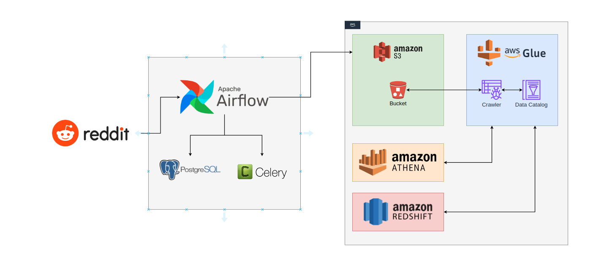

# 📊 Reddit ETL Pipeline

## 🎯 Objective

This project provides a data pipeline solution to extract, transform, and load (ETL) Reddit data into a Redshift data warehouse. The pipeline leverages a combination of tools and services including Apache Airflow, Celery, PostgreSQL, Amazon S3, AWS Glue, Amazon Athena, and Amazon Redshift.

With this project, you will learn:

- 🌬️ **Apache Airflow** with **Celery** and **PostgreSQL**
- 🐳 **Docker**
- 📝 Using the **Reddit API**
- 🛠️ **AWS Glue**
- 🗄️ **AWS S3**
- 📊 **AWS Athena**
- 🏢 **Redshift Data Warehousing**

---

## 🏗️ Architecture

The architecture of this pipeline is designed as follows:



---

## ⚙️ Prerequisites

To run this project locally, you will need the following:

- 🐍 Python 3.9 or higher
- 🐳 Docker and Docker Compose
- 🌍 Terraform
- ☁️ AWS CLI configured with valid credentials
- 🔑 Reddit API credentials (Client ID, Client Secret, Access Token)

---

## 🚀 How to Run the Project Locally

### 1. 📁 Clone the repository

```bash
git clone https://github.com/your-username/reddit-etl-pipeline.git
cd reddit-etl-pipeline
```

### 2. 🐍 Set up a virtual environment

It's recommended to use a virtual environment to manage dependencies:

```bash
python -m venv venv
source venv/bin/activate  # On Windows use `venv\Scripts\activate`
```

### 3. 📦 Install the required Python dependencies

Install the dependencies listed in `requirements.txt`:

```bash
pip install -r requirements.txt
```

### 4. 🔧 Set up environment variables

You need to configure your environment variables for Reddit API and AWS. Copy the provided `.env.example` to `.env` and fill in your credentials:

Edit the `.env` file and include your Reddit API keys, AWS access keys, and other necessary details.

### 5. 🏃‍♂️ Run Airflow with Docker Compose

Start the services with Docker Compose:

```bash
docker-compose up --build
```

Access the Airflow UI at `http://localhost:8080` and trigger the `reddit_dag`.

---

## 🌍 Terraform Setup

The infrastructure for this project is provisioned using Terraform.

### 1. 📝 Configure `terraform.tfvars`

Edit the `terraform.tfvars` file with your AWS credentials and other necessary variables.

### 2. ⚙️ Initialize Terraform

```bash
terraform init
```

### 3. 🔍 Plan and Apply

To preview the infrastructure changes:

```bash
terraform plan
```

To apply the infrastructure changes:

```bash
terraform apply
```

This will provision all necessary AWS services such as S3 buckets, AWS Glue, Athena, and Redshift.

---

## 🤝 Contributing

Feel free to submit pull requests or raise issues on GitHub. Contributions are welcome!

---

## 📝 License

This project is licensed under the MIT License. See the [LICENSE](LICENSE) file for more details.